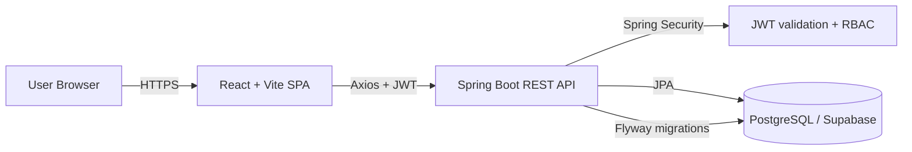
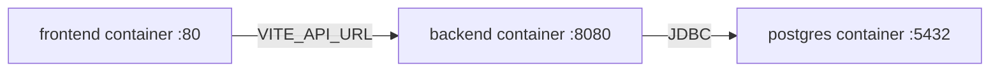

# Team Task Manager

Full-stack, collaborative task management system with Spring Boot 3, React 18, JWT authentication, project RBAC, and a Kanban board backed by PostgreSQL (Supabase).

## Contents

- Overview
- Features
- Architecture
- Backend
- Frontend
- Data model
- API overview
- Configuration
- Local development
- Deployment
- Build and test

## Video Demo
https://github.com/user-attachments/assets/0b9b3c2c-0d65-4088-b2c8-abac84f81174

## Overview

Team Task Manager helps teams organize projects, track tasks on a Kanban board, and collaborate through comments. The backend exposes a REST API secured by JWT and RBAC. The frontend is a React single page application that consumes the API via Axios and React Query.

## Features

- JWT authentication with role-based access control (ADMIN and MEMBER)
- Project and member management
- Task lifecycle with status and priority
- Kanban board and task detail views
- Task comments for collaboration
- Dashboard analytics (summary and per-user)
- Swagger UI for API exploration

## Architecture

### Component diagram



### Local Docker wiring



### Request flow

1. A user logs in or registers and receives a JWT from the API.
2. The frontend stores the token in local storage under the key `ttm_token`.
3. Axios attaches the token as a `Bearer` header on every API call.
4. Spring Security validates the JWT and applies RBAC checks.
5. Controllers call services, services use JPA repositories, and data is persisted in PostgreSQL.

## Backend

- Java 17, Spring Boot 3.2.5, Spring Security 6, Spring Data JPA
- JWT via `jjwt` and DTO mapping via MapStruct
- Flyway migrations for schema management
- Swagger UI at `/swagger-ui/index.html`
- Feature modules aligned to packages such as `auth`, `project`, `task`, `comment`, `membership`, `dashboard`, `security`, `config`, and `exception`

## Frontend

- React 18 with Vite, Tailwind CSS, and local shadcn-style UI primitives
- React Router v6 with protected routes for authenticated areas
- Zustand for auth state and TanStack React Query for API data management
- Axios client configured with `VITE_API_URL` (or `VITE_API_BASE_URL`) for base API routing

## Data model

Core tables (Supabase PostgreSQL):

- `users` for identities and credentials
- `projects` owned by a user
- `project_members` for membership and role (`ADMIN`, `MEMBER`)
- `tasks` linked to projects and assignees
- `task_comments` linked to tasks and authors

Key relationships:

- A user can own many projects and be a member of many projects.
- A project has many tasks and many members.
- A task can have many comments.

## API overview

Auth:

- `POST /api/auth/register`
- `POST /api/auth/login`
- `GET /api/auth/me`

Projects and members:

- `GET /api/projects`
- `POST /api/projects`
- `GET /api/projects/{id}`
- `PUT /api/projects/{id}`
- `DELETE /api/projects/{id}`
- `GET /api/projects/{id}/members`
- `POST /api/projects/{id}/members`
- `PUT /api/projects/{id}/members/{userId}`
- `DELETE /api/projects/{id}/members/{userId}`

Tasks:

- `GET /api/projects/{id}/tasks`
- `POST /api/projects/{id}/tasks`
- `GET /api/tasks/{id}`
- `PUT /api/tasks/{id}`
- `PATCH /api/tasks/{id}/status`
- `DELETE /api/tasks/{id}`
- `GET /api/tasks/{id}/comments`
- `POST /api/tasks/{id}/comments`

Dashboard:

- `GET /api/dashboard/summary`
- `GET /api/dashboard/per-user`

## Configuration

Backend environment variables:

- `SPRING_DATASOURCE_URL` (default `jdbc:postgresql://localhost:5432/teamtaskmanager`)
- `SPRING_DATASOURCE_USERNAME` (default `postgres`)
- `SPRING_DATASOURCE_PASSWORD` (default `postgres`)
- `APP_DB_SCHEMA` (default `teamtaskmanager`)
- `SPRING_FLYWAY_BASELINE_ON_MIGRATE` (default `false`)
- `JWT_SECRET` (default `dev-secret-change-me-please-32chars`)
- `JWT_EXP_MINUTES` (default `120`)
- `CORS_ALLOWED_ORIGINS` (default `http://localhost:5173`)

Frontend environment variables:

- `VITE_API_URL` (preferred)
- `VITE_API_BASE_URL` (fallback)

## Local development

Environment templates are available in `backend/.env.example` and `frontend/.env.example`.

### Docker Compose (recommended)

```bash
docker compose up --build
```

Services and ports:

- Frontend: http://localhost:5173
- Backend: http://localhost:8080
- Postgres: localhost:5432

### Run without Docker

```bash
cd backend
mvn spring-boot:run
```

```bash
cd frontend
npm install
npm run dev
```

## Supabase schema

You can either:

1. Let Flyway create the schema automatically by pointing `SPRING_DATASOURCE_URL`, `SPRING_DATASOURCE_USERNAME`, and `SPRING_DATASOURCE_PASSWORD` to Supabase.
2. Run `supabase/schema.sql` manually in the Supabase SQL editor.

For Supabase pooler connections, use SSL in the JDBC URL, for example:

```text
jdbc:postgresql://aws-0-region.pooler.supabase.com:6543/postgres?sslmode=require
```

If you run the schema manually for a custom schema, set `SPRING_FLYWAY_BASELINE_ON_MIGRATE=true` once so Flyway can create its schema history table.

## Deployment

Backend on AWS App Runner (or ECS):

- Build from `backend/Dockerfile` with the repository root as the Docker build context.
- Set `SPRING_DATASOURCE_URL`, `SPRING_DATASOURCE_USERNAME`, `SPRING_DATASOURCE_PASSWORD`, `JWT_SECRET`, `JWT_EXP_MINUTES`, and `CORS_ALLOWED_ORIGINS`.
- Set `CORS_ALLOWED_ORIGINS` to your Amplify frontend URL.

Frontend on AWS Amplify:

- Use `frontend/amplify.yml`.
- Set `VITE_API_URL` to the App Runner backend URL.

Docker frontend builds need the API URL at build time:

```bash
docker build --build-arg VITE_API_URL=https://your-backend.awsapprunner.com -t team-task-manager-frontend ./frontend
```

## Build and test

```bash
cd backend
mvn test
```

```bash
cd frontend
npm run build
```
